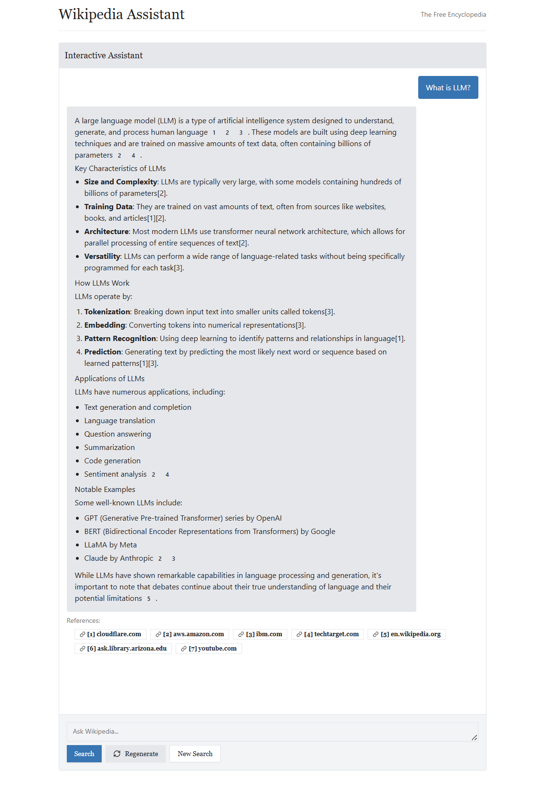

# Wikipedia Assistant

A specialized AI chatbot designed to make complex Wikipedia articles more accessible and easier to understand, built with modern web technologies.

Example queries:

-   Can you explain quantum computing in simple terms?
-   What is the significance of the Magna Carta?
-   Summarize the history of the Roman Empire



## Key Features

-   Simplifies complex Wikipedia content
-   Explains technical jargon in plain language
-   Provides concise summaries of lengthy articles
-   Breaks down complicated concepts into digestible explanations
-   Answers questions about Wikipedia content clearly and accurately
-   Includes relevant citations from Wikipedia sources

## User Benefits

-   Makes knowledge more accessible regardless of background or expertise
-   Reduces cognitive load when reading complex articles
-   Saves time by providing concise summaries
-   Improves comprehension of technical subjects
-   Enhances the overall Wikipedia experience

## Tech Stack


### Frontend

-   **NextJS 15**

    -   Full-stack React framework based on React for fast development.
    -   Built-in routing system using App Router.
    -   Server components for better performance and SEO.

-   **Shadcn UI + TailwindCSS**

    -   Lightweight and highly customizable component library.
    -   Pre-built chat interface components.
    -   TailwindCSS for easy modification of the style to match Wikipedia's aesthetic.

-   **Lucide Icons**

    -   Icon library for the application.

### Backend

-   **Perplexity API**

    -   Specialized LLM optimized for web search
    -   Provides grounded responses with citations to Wikipedia sources
    -   Direct access to up-to-date Wikipedia content

-   **Vercel AI SDK**

    -   Streamlined integration with AI models
    -   Built-in streaming support and helper functions for chatbot development, e.g., `useChat`.
    -   Type-safe API interactions

## Future Considerations

-   Integration with Wikipedia's API for more direct access to article content
-   Support for multiple languages to make Wikipedia accessible globally
-   Personalized learning paths based on user interests and reading history
-   Dark/Light mode support to match user preferences
-   Mobile optimization for on-the-go learning

## Setup

1. Copy `.env.example` to `.env.local` and set the environment variables.

```bash
cp .env.example .env.local
```

2. Install dependencies and run the development server.

```bash
npm install
npm run dev
```
